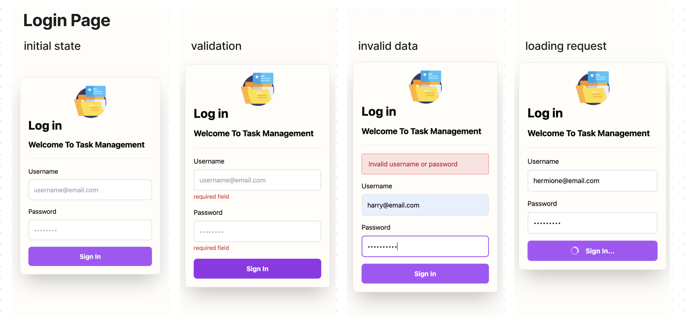
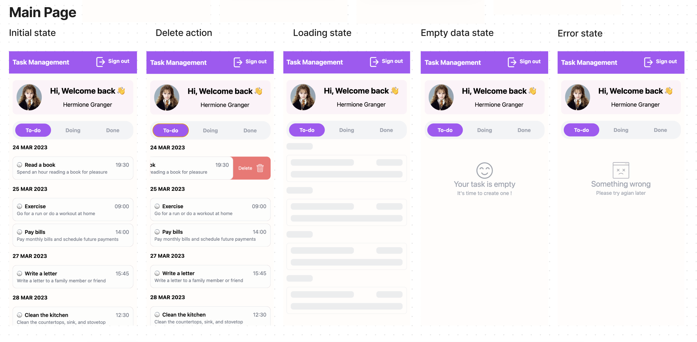

# Task Management

🌐 Live Demo : https://task-management-next.vercel.app

## Installation

Clone down this repository. You will need node and yarn installed globally on your machine.

Installation :

```bash
yarn
```

To Start Server :

```bash
yarn dev
```

To Visit App :

Open [http://localhost:3000](http://localhost:3000) with your browser to see the result.

To Run Test Suite :

```bash
yarn test
```
## Example Login Username/Password

1. Harry Potter
  
username : 
``
harry@email.com
``
password :
``
harry1234
``

2. Ron Weasley
  
username : 
``
ron@email.com
``
password :
``
ron1234
``

3. Hermione Granger
  
username : 
``
hermione@email.com
``
password : 
``
hermione1234
``

## Application Walkthrough
### Login Page
<p align="center">
  
</p>

### Main Page
<p align="center">
  
</p>

Thank you 😃


